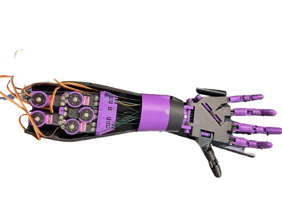
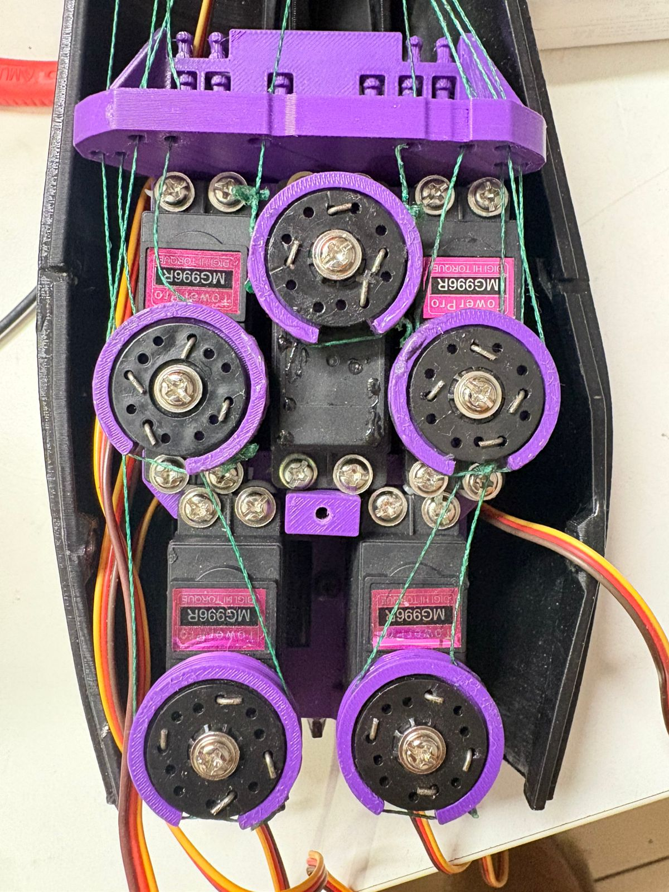
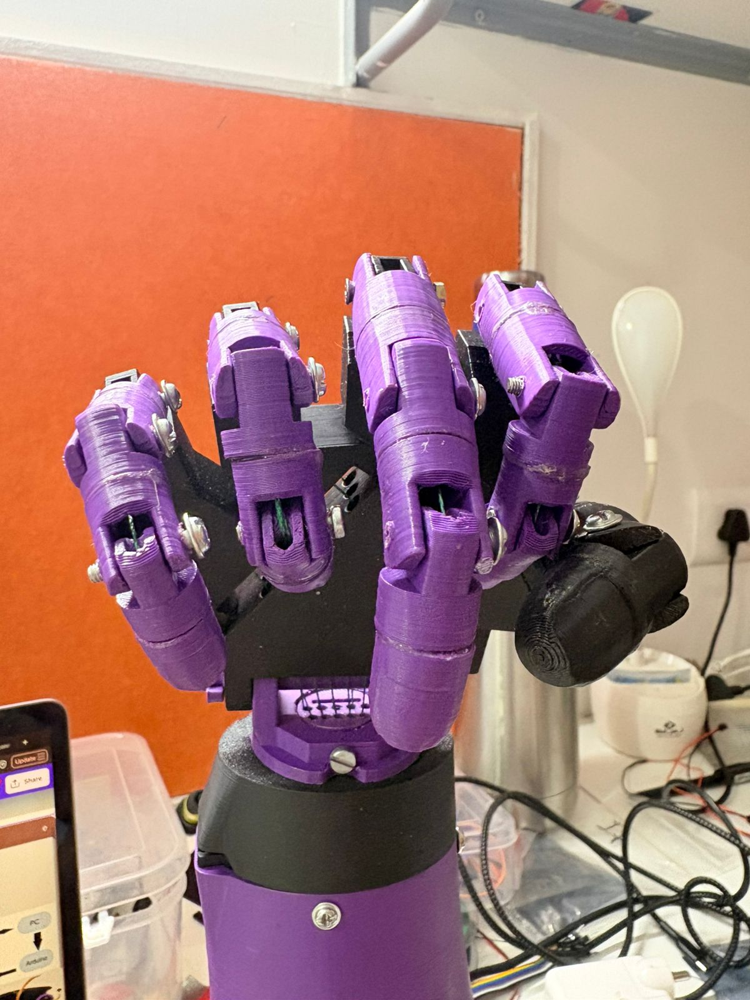
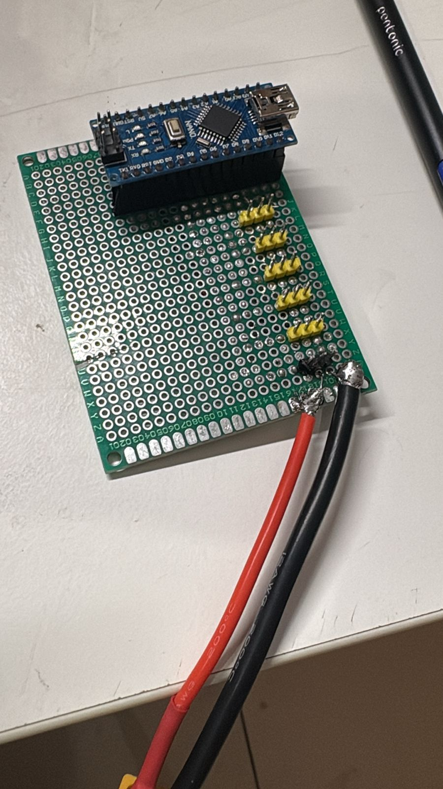
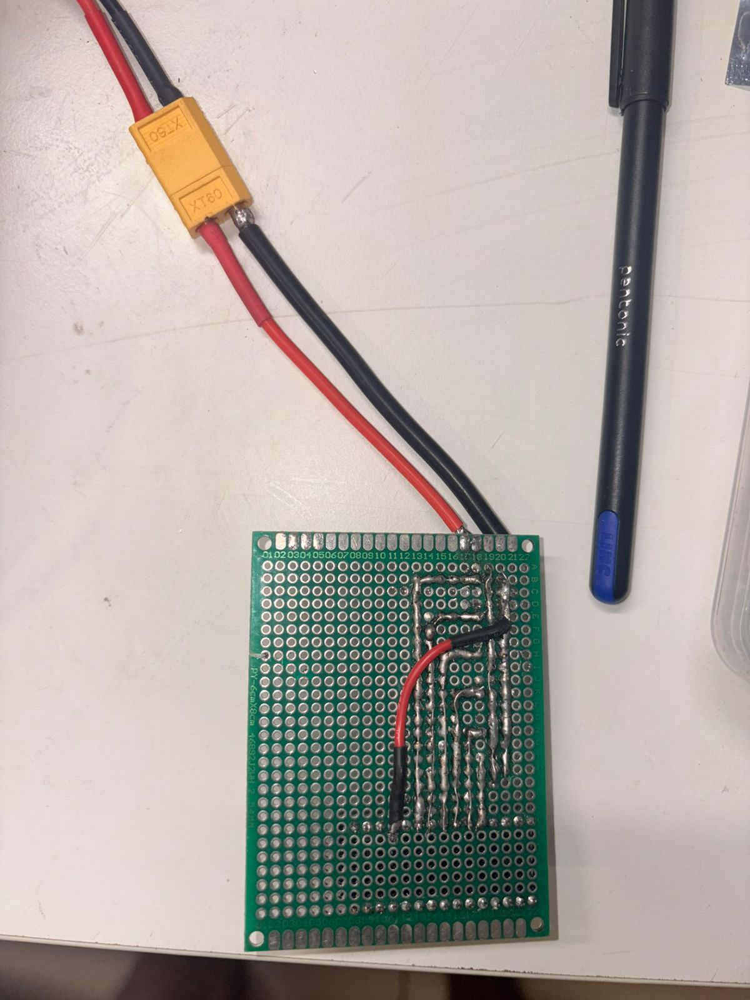
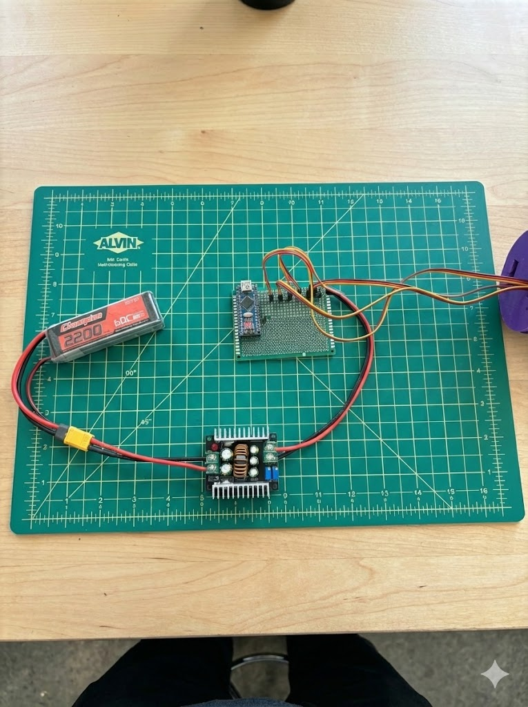

# Vision-Controlled Robotic Hand

A fully functional, computer-vision–controlled robotic hand that mirrors human finger movements in real time using a standard webcam.

This project combines mechanical actuation, embedded control, and real-time vision processing. Hand landmark tracking is performed on the PC, while low-level motor control is handled by an Arduino-based controller.

This repository documents a **working system**, not a simulation or concept build.

---


## Overview

The robotic hand is controlled using hand-tracking data extracted from a live camera feed. Finger positions are mapped to servo angles and transmitted to the controller over serial communication.

The system was built with rapid iteration and reliability in mind, using a zero-board (perfboard) wiring approach rather than a custom PCB.

Mechanical inspiration for the hand structure was taken from the open-source InMoov project. Electronics, wiring logic, control strategy, and software integration were designed and implemented independently.



---

## System Architecture

```
Webcam
  ↓
Python (OpenCV + MediaPipe)
  ↓  Serial (USB)
Arduino Nano
  ↓
Servo Motors
  ↓
Robotic Hand
```

---

## Actuation System

The hand is actuated using high-torque servo motors arranged to provide independent finger control.
<p align="center">

</p>
---

## Hardware

- **Controller:** Arduino Nano  
- **Actuators:** MG996R servo motors (one per finger)  
- **Power:**  
  - 3S LiPo battery  
  - External DC-DC buck converter for regulated servo power  
- **Wiring:**  
  - Zero board (perfboard) with point-to-point soldering  
  - No custom PCB used in this build  
- **Mechanical:**  
  - 3D printed hand structure  
  - Tendon-driven fingers using braided line  

> Power for servos is isolated from the Arduino logic supply to prevent brownouts.

---

## Software

### Python (Host Side)
- OpenCV – video capture and processing  
- MediaPipe – real-time hand landmark detection  
- Custom Python script for:
  - Finger angle extraction  
  - Mapping landmarks → servo angles  
  - Serial communication with Arduino  

### Arduino (Embedded Side)
- Receives servo angle commands over serial  
- Drives individual servo motors accordingly  
- The Arduino sketch **must be flashed first** for the Python script to work  

---

## Motion Demonstration

The system supports real-time finger curling driven by computer vision input.

<p align="center">
  
</p>

---

## Control Electronics

The control electronics were implemented on a zero-board using direct tin wiring for rapid iteration and debugging.





---

## System Integration

<p align="center">
  
  <br>
  <em>LiPo-powered system with buck regulation and Nano-based control electronics</em>
</p>

---

## Repository Structure

```
.
├── Arduino/
│   └── robotic_hand_controller.ino
│
├── Python/
│   └── hand_tracking_control.py
│
├── Images/
│   ├── full_system_setup.jpg
│   ├── wiring_closeup.jpg
│   └── robotic_hand.jpg
│
├── LICENSE_HARDWARE
├── LICENSE_SOFTWARE
└── README.md
```

---

## Setup Instructions

### 1. Flash Arduino Code
- Open the Arduino sketch from `/Arduino`
- Select **Arduino Nano**
- Flash the code to the board

### 2. Python Environment
Install dependencies:
```bash
pip install opencv-python mediapipe pyserial
```

### 3. Run the System
- Connect Arduino via USB
- Connect external power to servos
- Run the Python script:
```bash
python hand_tracking_control.py
```

---

## Notes & Design Decisions

- Zero-board wiring was chosen for speed, flexibility, and ease of debugging  
- External power regulation is mandatory for stable servo operation  
- Latency is low enough for intuitive real-time control  
- This system prioritizes robustness over miniaturization  

---

## Licenses

- **Hardware:** CERN Open Hardware Licence v2  
- **Software:** MIT License  

See `LICENSE_HARDWARE` and `LICENSE_SOFTWARE` for details.

---

## Status

✅ Fully built  
✅ Fully functional  
✅ Tested with real-time hand tracking  

Future improvements may include feedback sensors, and improved kinematic mapping.

---

## Author

Pranav Anil  
Robotics & Embedded Systems  

If you build on this, credit is appreciated.
